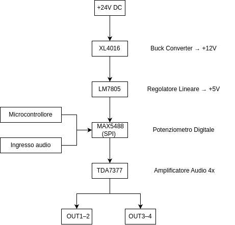

# 🔊 Amplificatore Audio con Controllo Digitale del Volume (MAX5488 + TDA7377)

**Versione:** 1.0  
**Autore:** Obbialero Andrea  
**Data:** 27/01/2024  

---

## 📌 Descrizione del Progetto

Questo progetto consiste nella realizzazione di un amplificatore audio stereo a 4 canali con controllo digitale del volume tramite interfaccia SPI, interamente integrato su un unico PCB.

### Componenti principali:
- **MAX5488**: potenziometro digitale controllato via SPI
- **TDA7377**: amplificatore di potenza per uscita audio
- Alimentazione separata per sezione logica e amplificazione

---

## 🔧 Specifiche Tecniche

| Caratteristica     | Valore                          |
|--------------------|---------------------------------|
| Canali Audio       | 4 (stereo ×2)                   |
| Amplificatore      | TDA7377                         |
| Controllo Volume   | Digitale via SPI (MAX5488)      |
| Alimentazioni      | +24V, +12V, +5V                 |
| Regolatori         | XL4016 (Buck), LM7805 (Lineare) |
| Ingressi Audio     | Jack PJ-3200                    |
| Uscite Audio       | Connettori 4 pin                |
| PCB                | Progettato da zero              |

---

## 📦 Distinta Base (BOM)

Consulta la [Distinta Base completa](https://github.com/Obbialero/Amplifier-V1.0/blob/main/hardware/BOM_PCB_AMPLIFIER_V1.0.csv) per tutti i componenti utilizzati, comprensivi di codici, valori e note tecniche.

---

## 🔌 Schema a Blocchi

---

## 🎚️ Controllo Volume Digitale (SPI)

Il controllo del volume è gestito dal **MAX5488**, un doppio potenziometro digitale che consente la regolazione separata dei canali audio **destro (DX)** e **sinistro (SX)**.

Nel progetto è utilizzato un **microcontrollore STM32L432KC** (linea STM32 a basso consumo di STMicroelectronics) per pilotare il MAX5488 tramite interfaccia **SPI**.  
Tuttavia, il dispositivo è compatibile con qualsiasi microcontrollore dotato di interfaccia SPI, come **Arduino**, **ESP32**, **Raspberry Pi Pico** o simili.

### 🧪 Interfaccia SPI – Segnali utilizzati:

| Segnale | Descrizione             |
|---------|--------------------------|
| **SCLK** | Clock seriale            |
| **DIN**  | Dati seriali in ingresso |
| **CS#**  | Chip Select (attivo basso) |

Il MAX5488 mantiene l'ultimo valore impostato anche in assenza di segnale SPI, rendendolo ideale per applicazioni audio embedded dove si desidera un controllo software preciso e persistente.

---

## 🧱 Filtraggio e Protezione

| Componente         | Funzione                                  |
|--------------------|-------------------------------------------|
| LC Filter          | 47 µH + 100nF–1000µF su linee Vcc          |
| Diodo Schottky     | VS-10BQ040-M3 su linea +24V               |
| Diodo 1N4148       | Protezione segnali digitali               |
| Condensatori       | Di bypass, ravvicinati ai pin di alimentazione |

---

## 📎 Connettori

| Componente | Funzione                  |
|------------|---------------------------|
| PJ-3200    | Ingresso audio stereo     |
| U11/U13    | Connettori audio 4 pin    |
| P11        | Ingresso alimentazione    |

---

## 🛠️ Raccomandazioni PCB

- Tracce di potenza (24V/12V): ≥2 mm di larghezza  
- Separazione masse: PW-GND (potenza) e S-GND (segnale) ben distinte  
- Linee SPI: il più corte possibile per minimizzare interferenze  
- Condensatori bulk: montati vicino a XL4016 e TDA7377  

---

## 📁 File Inclusi

- [Gerber_PCB_AMPLIFIER_V1.0.zip](https://github.com/Obbialero/Amplifier-V1.0/raw/main/Gerber_PCB_AMPLIFIER_V1.0.zip) – File Gerber per produzione PCB  
- [BOM_PCB_AMPLIFIER_V1.0.csv](https://github.com/Obbialero/Amplifier-V1.0/raw/main/BOM_PCB_AMPLIFIER_V1.0.csv) – Distinta base dei componenti  
- [PickAndPlace_PCB_amplifier_V1.0.csv](https://github.com/Obbialero/Amplifier-V1.0/raw/main/PickAndPlace_PCB_amplifier_V1.0.csv) – Coordinate per montaggio automatico  
- [PCB_amplifier_V1.0.json](https://github.com/Obbialero/Amplifier-V1.0/raw/main/pcb_amplifier_schematich/PCB_amplifier_V1.0.json) – Schema PCB (JSON)  
- [SCH_AMPLIFIER_V1.0.json](https://github.com/Obbialero/Amplifier-V1.0/raw/main/pcb_amplifier_schematich/SCH_AMPLIFIER_V1.0.json) – Schema elettrico (JSON)  
- [PNG_AMPLIFIER/](https://github.com/Obbialero/Amplifier-V1.0/tree/main/docs/PNG_AMPLIFIER) – Cartella contenente le immagini del PCB e schematici  

---

## 🖼️ Immagini e PCB

### 🔧 Schema elettrico

### 📐 PCB - Layout 2D

### 🖥️ PCB - Vista assemblata

---

## ⚠️ Avvertenze

⚠️ Attenzione: la linea da 24V può generare surriscaldamento.  
Utilizzare dissipatori su **XL4016** e **TDA7377** per evitare thermal shutdown.  
Assicurarsi che le masse siano ben collegate e le connessioni audio schermate.

---

## 📌 Consigli d’Uso

- Fornire un'alimentazione stabilizzata adeguata alle specifiche del TDA7377  
- Verificare sempre l’integrità del circuito prima della produzione in serie  
- Utilizzare un cabinet schermato per evitare interferenze audio  

---

## 📬 Contatti

Per dubbi, miglioramenti o segnalazioni:  
**Andrea Obbialero** – https://obbialero.github.io/

---

## 📘 Licenza

Questo progetto è rilasciato sotto licenza **MIT**.  
Libero per uso personale, educativo e commerciale con attribuzione.

